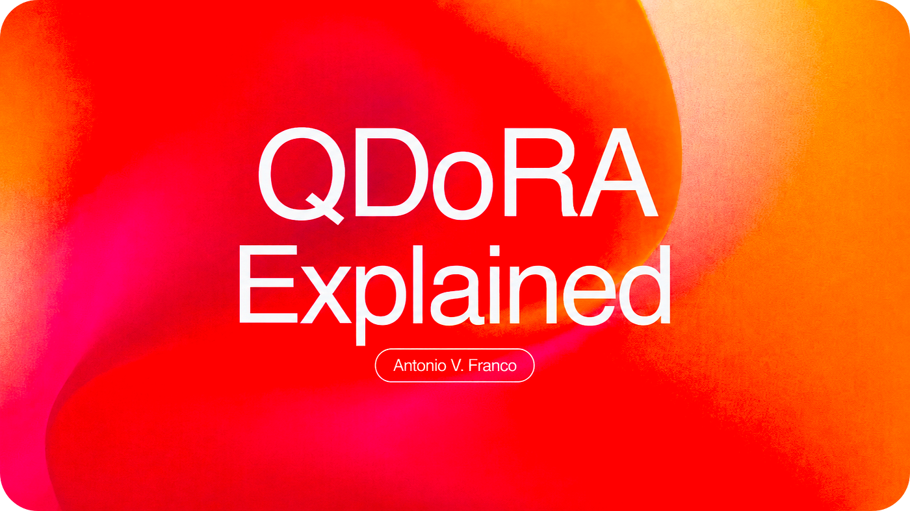

The landscape of parameter-efficient fine-tuning has been going through a quiet revolution since 2021, and most people haven’t noticed yet. While LoRA democratized LLM fine-tuning by drastically reducing memory requirements — letting researchers train models on consumer GPUs instead of needing expensive clusters — it always had this nagging problem: it couldn’t quite match the performance of full fine-tuning. The gap wasn’t huge, maybe 2–5% on most benchmarks, but it was there. And in competitive research or production systems, that gap matters.

Enter QDoRA. I know, I know, another acronym in the PEFT zoo. But this one’s different. QDoRA combines the mathematical elegance of weight decomposition with aggressive quantization in a way that not only matches full fine-tuning performance but sometimes actually exceeds it, all while using less memory than QLoRA. If that sounds too good to be true, I thought so too until I started digging into the math and running experiments.

In this deep dive, I’m going to dissect QDoRA’s architecture from first principles, explore the mathematical foundations that make it work, and show you exactly how I’m planning to leverage it for Uranus-3B — my specialized 3-billion-parameter language model focused on quantum physics and multidimensional theories. This isn’t going to be one of those surface-level “here’s how to pip install” tutorials. We’re going deep, but I promise it’ll be worth it.

## The Evolution

### LoRA

Let’s start with where it all began. Low-Rank Adaptation, introduced by Microsoft Research in 2021, revolutionized fine-tuning by exploiting a deceptively simple insight: most fine-tuning updates operate at a low intrinsic rank. In other words, when you fine-tune a massive language model, you’re not really using all those billions of parameters in a truly independent way. The updates you’re making can be approximated by a much lower-dimensional transformation.

The mathematical formulation is elegant. Instead of updating all model parameters directly, LoRA freezes the pre-trained weight matrix W₀ and introduces trainable low-rank decomposition matrices. The forward pass becomes h = W₀x + BAx, where B and A are these low-rank matrices with dimensions d×r and r×k respectively, and crucially, r is much smaller than both d and k (typically between 8 and 64). The term BA approximates the weight update ΔW, but instead of storing and training a d×k matrix, you’re only working with (d+k)×r parameters. For large matrices, this can mean reducing trainable parameters by a factor of 10,000 while maintaining roughly 99% of full fine-tuning quality.

### QLoRA

Now, LoRA was great, but it still required keeping the full base model in memory, which meant you needed beefy GPUs even for 7B parameter models. QLoRA came along and said “what if we quantize the frozen base model to 4-bit precision?” The innovation wasn’t just in quantization itself — people had been quantizing neural networks for years — but in how QLoRA made it work with LoRA adapters.

The secret sauce was NormalFloat4, or NF4, a data type specifically designed for normally distributed weights. Most neural network weights follow a roughly normal distribution, so NF4 allocates its 16 possible values (4 bits = ²⁴ = 16 values) non-uniformly to match this distribution. You get better precision where most weights cluster around zero and less precision at the tails where weights are rare anyway. Beyond NF4, QLoRA introduced double quantization (quantizing the quantization constants themselves), paged optimizers to handle memory spikes during backpropagation, and a clever trick where computation happens in BFloat16 even though storage is in 4-bit.

The result? You could fine-tune a 65B parameter model on a single 48GB GPU. That was revolutionary. But — and this is the important part — QLoRA still exhibited the same fundamental limitation as LoRA. The learning pattern was different from full fine-tuning. The performance was close, often within a few percentage points, but that gap persisted. And nobody quite understood why until DoRA came along.

### DoRA

The breakthrough came in February 2024 when a team of NVIDIA researchers led by Shih-Yang Liu published a paper that would fundamentally change how we think about efficient fine-tuning. The paper was later accepted as an oral presentation at ICML 2024, which tells you something about how important the community thought it was — only about 1.5% of ICML submissions get selected for oral presentations.

The core insight came from a careful analysis of how LoRA and full fine-tuning actually update weights during training. The researchers decomposed weights using vector normalization: W = m · (V / ||V||), where m represents the magnitude (just the L2 norm of the weight vector) and V / ||V|| represents the directional unit vector. This decomposition might sound simple — and mathematically it is — but it revealed something profound about the difference between LoRA and full fine-tuning.

When they looked at how full fine-tuning updates weights, they found that magnitude and direction changed independently. The correlation between magnitude changes and directional changes was negative, hovering around -8.0. This means that when the magnitude increased, direction often shifted in a way that partially compensated, and vice versa. It’s like the model was able to adjust the scale of features independently from their semantic content.

LoRA, on the other hand, showed a positive correlation around +2.0. Magnitude and direction changed in lockstep. If LoRA increased the magnitude, it also pushed the direction in the same way proportionally. This coupled updating pattern meant LoRA lacked the nuanced capability for subtle adjustments — it couldn’t do things like make a small directional change while making a large magnitude shift, or vice versa. And the researchers suspected this limitation stemmed from asking LoRA to learn both magnitude and directional adaptation simultaneously, which was apparently too complex a task for the low-rank constraint.

So they proposed DoRA: Weight-Decomposed Low-Rank Adaptation. The architecture decomposes the pre-trained weight and applies LoRA only to the directional component. The new weight becomes W’ = m · (V₀ + BA) / ||V₀ + BA||, where m is now a trainable magnitude vector (one scalar per output dimension), V₀ is the frozen pre-trained directional component, and BA are the familiar LoRA matrices. The normalization denominator ||V₀ + BA|| ensures the directional component remains unit-normalized while LoRA learns directional updates.

The elegance of this approach becomes clear when you think about gradient flow. The gradient with respect to magnitude is straightforward: ∂L/∂m = ∂L/∂W’ · (V + BA) / ||V + BA||. You’re just scaling the direction by the loss gradient. But the gradient with respect to the LoRA matrices involves the chain rule through that normalization term, which creates this interesting dynamic where directional updates are inherently decoupled from magnitude. The math works out to ∂L/∂B = ∂L/∂W’ · [m · (I/||V + BA|| — (V + BA)(V + BA)ᵀ/||V + BA||³)] · A, and that middle term effectively projects the gradient onto the tangent space of the unit sphere. If you’re familiar with optimization on manifolds, you’ll recognize this pattern.

What’s remarkable is that DoRA doesn’t add inference overhead. After training, you can merge the magnitude and the LoRA-adjusted direction back into a single weight matrix, exactly like you can with standard LoRA. The decomposition is purely a training-time construct that shapes the learning dynamics to be more like full fine-tuning.

### QDoRA

So DoRA was impressive, but it still had the same memory footprint as regular LoRA — you needed to keep the full precision base model in memory. This is where Answer.AI enters the story. Led by Jeremy Howard (co-founder of fast.ai) and featuring exceptional work by Kerem Turgutlu, they asked the obvious question: what if we combine DoRA’s weight decomposition with QLoRA’s quantization?

The result, which they released in April 2024, was QDoRA. The architecture is conceptually straightforward but the implementation details matter enormously. You start with a 4-bit quantized base model — either using bitsandbytes NormalFloat4 or Half-Quadratic Quantization depending on your needs. Then you apply DoRA’s magnitude-direction decomposition to these quantized weights. The magnitude parameters stay in full precision (they’re just scalars per output dimension, so the memory cost is negligible), and the LoRA adapters operate in BFloat16.

The forward pass involves dequantizing the base weights on the fly, applying the LoRA transformation to get the directional update, normalizing to maintain unit direction, then scaling by the magnitude. In pseudocode, it looks something like this: you dequantize W_quantized from NF4 to BF16, compute direction = V + BA where V is the dequantized weight and BA is your LoRA update, normalize it with direction_norm = direction / ||direction||, scale by magnitude m * direction_norm, and finally do your matrix multiplication. The key is that the base weights stay quantized in storage; you only dequantize temporarily for computation.

Let’s talk numbers because they’re striking. For a single linear layer with dimensions d×k, you need roughly d×k×0.5 bytes for the quantized base (4 bits per parameter), d parameters for magnitude in FP32, and (d+k)×r parameters for the LoRA matrices in BF16. The total trainable parameters end up being around 2–3% of the base model size. Taking Llama-2–7B as a concrete example: the base model in 4-bit takes about 3.5 GB, the QDoRA adapters add maybe 300 MB, and your total training memory footprint lands around 12–16 GB. Compare that to 112 GB for full fine-tuning and you start to see why this matters.

But here’s the thing that really caught my attention when I first saw Answer.AI’s results: QDoRA didn’t just match full fine-tuning performance. On the Orca-Math dataset, which tests mathematical reasoning, QDoRA with 100K training samples achieved 31.2% exact match accuracy. Full fine-tuning got 26.0%. QLoRA managed 11.8%. Even full fine-tuning followed by post-quantization — a common deployment strategy — only hit 16.8%. QDoRA outperformed full fine-tuning by nearly 5 percentage points while using roughly nine times less memory. That’s not supposed to happen. Efficient methods aren’t supposed to beat the gold standard.

The explanation, I think, lies in how DoRA’s decomposition interacts with quantization noise. Regular QLoRA asks the low-rank adapters to compensate for both the limitations of the low-rank constraint and the errors introduced by quantization. That’s a lot to ask. DoRA’s magnitude parameters provide an additional degree of freedom that can absorb some of the quantization noise, letting the directional component focus purely on learning the semantic transformations. It’s speculation on my part, but the empirical results are hard to argue with.

## Deep Dive: Mathematical Foundations

Let’s dig deeper into why this actually works. The mathematical foundations of DoRA draw inspiration from Weight Normalization, a technique introduced by Salimans and Kingma back in 2016. Their original idea was to reparameterize neural network weights as W = g · (v / ||v||), where g is a scalar and v is a vector. This reparameterization decouples the norm of the weight from its direction, and it turns out this improves gradient conditioning — the gradients flow more smoothly during training, leading to faster convergence.

DoRA extends this concept in three crucial ways. First, instead of a single scalar g for the entire weight matrix, DoRA makes the magnitude learnable per output dimension, giving you a vector m of scalars rather than just one global scale. Second, and more importantly, DoRA applies LoRA to the directional component v, letting you learn directional updates efficiently without storing full-rank matrices. Third, the normalization is maintained dynamically through the denominator ||V + BA||, which ensures that no matter how LoRA adjusts the direction, you’re always working with unit vectors.

The gradient flow tells you a lot about why this works better than regular LoRA. When you compute gradients with respect to the magnitude m, you get ∂L/∂m = ∂L/∂W’ · (V + BA) / ||V + BA||. This is clean and direct — the magnitude is learning to scale the effective direction based purely on the loss gradient. There’s no complicated interaction with the directional learning.

The gradient with respect to the LoRA matrices is more interesting. Because of the normalization, you need the chain rule: ∂L/∂B = ∂L/∂W’ · [m · (I/||V + BA|| — (V + BA)(V + BA)ᵀ/||V + BA||³)] · A. That middle term might look intimidating, but geometrically it’s doing something elegant — it’s projecting the gradient onto the tangent space of the unit sphere. If you’ve studied Riemannian optimization or manifold learning, you’ll recognize this as the natural gradient for optimization on the unit sphere. The practical effect is that magnitude adjustments and directional updates become decoupled in gradient space, allowing independent optimization of scale and semantics.

One of the most surprising findings from the DoRA paper was that the method exhibits superior performance at lower ranks compared to LoRA. When you drop LoRA down to rank 8, quality typically degrades significantly. But DoRA maintains quality even at rank 8, sometimes outperforming LoRA at rank 32. My interpretation is that DoRA’s independent magnitude tuning compensates for the reduced expressiveness of the low-rank directional component. You’re effectively getting more representational power without actually adding more parameters to the directional adaptation. The magnitude vector provides an additional degree of freedom that captures something LoRA’s coupled updates can’t.

## Practical Implementation with PEFT

The Hugging Face PEFT library makes QDoRA remarkably accessible, which is both impressive and slightly dangerous — it’s easy to get something running without understanding what’s actually happening under the hood. Let me walk you through a proper implementation that actually works well in practice, not just in documentation examples.

First, you need to configure your quantization carefully. The BitsAndBytesConfig is where most people make their first mistake. You want load_in_4bit set to True obviously, but the crucial parameter is bnb_4bit_compute_dtype — set this to torch.bfloat16, not float16. BFloat16 has better numerical stability for the kinds of operations QDoRA does during training, and while it’s technically lower precision than float16 in terms of mantissa bits, the wider exponent range matters more here. Double quantization (bnb_4bit_use_double_quant) should definitely be True — it quantizes the quantization constants themselves, saving another chunk of memory with basically no quality impact. And use NF4 (nf4) as your quantization type, not fp4. NF4 is information-theoretically optimal for normally distributed weights, which is exactly what you have in most language models.

```python
from peft import LoraConfig, get_peft_model, prepare_model_for_kbit_training
from transformers import AutoModelForCausalLM, BitsAndBytesConfig
import torch
```

```python
bnb_config = BitsAndBytesConfig(
    load_in_4bit=True,
    bnb_4bit_use_double_quant=True,
    bnb_4bit_quant_type="nf4",
    bnb_4bit_compute_dtype=torch.bfloat16
)
```

```python
model = AutoModelForCausalLM.from_pretrained(
    "meta-llama/Llama-2-7b-hf",
    quantization_config=bnb_config,
    device_map="auto"
)
```

```python
model = prepare_model_for_kbit_training(model)
```

Now for the LoRA configuration. This is where DoRA differs meaningfully from regular LoRA in terms of hyperparameters. Start with a lower rank than you’d use for LoRA — if you were planning r=32 for LoRA, try r=16 for DoRA. The independent magnitude optimization means you need less directional expressiveness to achieve the same quality. Your alpha should stay at 2× your rank as usual, but pay attention to dropout. DoRA benefits from slightly higher dropout than LoRA, something around 0.05 to 0.1 instead of the 0.0 to 0.05 you might use for regular LoRA. This helps prevent the magnitude parameters from overfitting, which can happen because they’re full precision and not constrained by a low-rank bottleneck.

Target all the linear layers in attention and the MLP blocks. Some tutorials will tell you to just target q_proj, k_proj, and v_proj in attention, but DoRA actually benefits from more comprehensive coverage. Hit the output projection, the gate projection, everything. The memory cost is still reasonable because of the low rank, and you get better quality. The critical parameter, of course, is use_dora=True. Without that, you’re just doing regular QLoRA.

```python
lora_config = LoraConfig(
    r=16,
    lora_alpha=32,
    target_modules=[
        "q_proj", "k_proj", "v_proj", "o_proj",
        "gate_proj", "up_proj", "down_proj"
    ],
    lora_dropout=0.05,
    bias="none",
    task_type="CAUSAL_LM",
    use_dora=True
)
```

```python
model = get_peft_model(model, lora_config)
model.print_trainable_parameters()
```

When you run print_trainable_parameters(), you’ll typically see something like 0.6–0.8% trainable parameters for a 7B model with these settings. That’s 41–55 million parameters out of ~7 billion, which is astonishingly small but entirely sufficient for most fine-tuning tasks.

The hyperparameter choices matter more for DoRA than for regular LoRA, and this is where experience helps. Learning rate should be roughly 0.5 to 0.7 times what you’d use for LoRA. If you’re used to 2e-4 for LoRA, try 1e-4 for DoRA. The reason is that DoRA converges faster — the decoupled magnitude and direction optimization reaches good solutions more quickly, and if your learning rate is too high, you’ll overshoot and get instability. I’ve seen training runs diverge at epoch 2 or 3 with learning rates that would have been fine for LoRA.

Rank selection follows a different logic too. Use roughly half to two-thirds of the rank you’d choose for LoRA. DoRA at r=16 often matches or beats LoRA at r=32 because of that independent magnitude tuning I keep harping on about. Lower ranks also mean faster training and less memory, which compounds the benefits. And as I mentioned, slightly higher dropout helps — 0.05 to 0.1 versus 0.0 to 0.05 for LoRA. You’re guarding against magnitude overfitting, which is a real failure mode that doesn’t exist in regular LoRA.

## Case Study

Let me get personal for a moment and talk about why all of this matters for my own work. I’m building Uranus-3B, a specialized 3-billion-parameter language model focused on quantum physics, advanced mathematics, sacred geometry, and multidimensional theories. It’s an unusual mix of topics, I know, but there’s a method to it. The intersection of rigorous physics and more esoteric theoretical frameworks requires a model that can handle both the mathematical precision of quantum field theory and the symbolic reasoning of sacred geometry without treating them as incompatible domains.

The project is currently in data collection and curation, with a target corpus of 50 to 100 GB of high-quality domain-specific content. The base architecture will be modified from Qwen 2.5 3B, with an extended vocabulary to properly handle quantum physics notation and mathematical symbols. We’re targeting 32K token context length and training on RunPod H100 instances when we get to the actual pre-training phase.

Here’s where QDoRA becomes absolutely critical for the project. While Uranus-3B will be pre-trained from scratch on the initial corpus, the real value comes from continued pre-training and domain adaptation on increasingly specialized sub-corpora. This is where most specialized models fail — they either overfit to their narrow domain and forget general capabilities, or they never achieve true specialization because full fine-tuning on small domain-specific corpora isn’t practical. QDoRA offers a way out of this dilemma.

My plan involves three phases of continued pre-training, each narrowing the focus while building on the previous phase. Phase one establishes a general scientific foundation with about 30 GB of physics textbooks, mathematical proofs, and scientific papers. This phase uses full training with gradient checkpointing — we’re still working with a large, diverse corpus, so the benefits of PEFT methods aren’t as pronounced yet. I’m estimating roughly 100 hours on 4×H100 for this phase.

Phase two is where QDoRA enters. This is quantum physics specialization using about 15 GB of quantum mechanics, quantum field theory, and quantum information theory texts. Here I’ll use QDoRA with rank 32, targeting all linear layers. The memory savings compared to full continued pre-training are around 60%, which means instead of needing a full cluster, I can run this on 2×H100 instances. More importantly, the DoRA decomposition helps preserve the general scientific knowledge from phase one while adding quantum-specific capabilities. I’m expecting this to take about 24 hours.

Phase three is the most delicate: integrating the esoteric content without destroying the scientific rigor built in phases one and two. This is roughly 5 GB of sacred geometry, hermetic principles, and multidimensional theory texts. For this phase, I’ll drop to rank 16 — the smaller corpus doesn’t justify higher rank, and the lower rank actually helps prevent overfitting to what is inevitably a more idiosyncratic dataset. The goal here isn’t to make the model believe in any particular metaphysical framework, but to make it fluent in the symbolic languages and reasoning patterns used in these domains. Eight hours on a single H100 should be sufficient.

Beyond the phased training, QDoRA enables something I’m calling task-specific adapters. The idea is to train multiple separate adapters for different use cases, then swap them at inference time. For mathematical proof generation, I’m planning an adapter with rank 24 targeting the attention layers (q_proj, k_proj, v_proj, o_proj). For quantum circuit design, rank 16 targeting attention and the MLP up-projection should work. For symbolic reasoning, which is the most demanding task, rank 32 targeting everything. Each adapter ends up being less than 500 MB, and you can hot-swap them based on what the user is trying to do.

But here’s where it gets interesting. I’m experimenting with what I’m calling hierarchical or multi-resolution QDoRA, where different layers use different ranks. The hypothesis is that deeper layers require higher expressiveness for complex quantum reasoning, while early layers can use more aggressive compression. My initial plan assigns rank 8 to layers 0–7 (input layers capturing surface patterns), rank 24 to layers 8–19 (middle layers handling semantic representations), rank 48 to layers 20–27 (deep layers doing abstract reasoning), and rank 64 to layers 28–31 (output layers where generation quality is most critical). This is speculative — I haven’t seen anyone try this systematically — but the theoretical motivation seems sound.

For the quantization strategy, I’m planning to use Half-Quadratic Quantization instead of bitsandbytes NF4, and there are specific technical reasons for this choice. HQQ preserves outliers better, which matters enormously when you’re dealing with mathematical notation and special symbols. In natural language, weight distributions are relatively well-behaved, but add in quantum physics equations with unusual Unicode characters and the distribution gets heavier tails. HQQ’s approach to handling these outliers means less information loss during quantization. There’s also a practical speed advantage — HQQ dequantization is about 15–20% faster than NF4, which compounds over a long training run. Finally, HQQ lets you configure the group size for quantization, so you can tune the granularity. For Uranus-3B, I’m planning to use group_size=64 rather than the default 128, accepting slightly higher memory cost for better preservation of those mathematical outliers.

```python
from transformers import HqqConfig
```

```python
hqq_config = HqqConfig(
    nbits=4,
    group_size=64,
    quant_zero=True,
    quant_scale=True,
    axis=1,
    offload_meta=True
)
```

```python
model = AutoModelForCausalLM.from_pretrained(
    "QuanyuanAI/uranus-3b-base",
    quantization_config=hqq_config,
    device_map="auto",
    torch_dtype=torch.bfloat16
)
```

The training loop needs careful attention to gradient accumulation because we’re memory-constrained even with QDoRA. My plan is to use batch size 1 per device with 32 gradient accumulation steps, giving an effective batch size of 32. This is small enough to fit in VRAM but large enough that optimization is stable. Gradient checkpointing will be enabled, obviously, but there’s a subtlety here that people miss. DoRA’s normalization operation interacts poorly with naive gradient checkpointing because you’re recomputing that denominator ||V + BA|| multiple times, and floating point rounding means the recomputed value isn’t bitwise identical to the original. This can cause optimization instabilities. The solution is selective gradient checkpointing that skips the DoRA layers themselves.

```python
import torch
from torch.optim import AdamW
from transformers import get_cosine_schedule_with_warmup
```

```python
batch_size = 1
grad_accum_steps = 32
gradient_checkpointing = True
```

```python
optimizer = AdamW(
    model.parameters(),
    lr=5e-5,
    betas=(0.9, 0.999),
    weight_decay=0.01
)
```

```python
scheduler = get_cosine_schedule_with_warmup(
    optimizer,
    num_warmup_steps=500,
    num_training_steps=10000
)
```

```python
model.train()
for epoch in range(num_epochs):
    for step, batch in enumerate(train_loader):
        outputs = model(**batch)
        loss = outputs.loss / grad_accum_steps
        loss.backward()

        if (step + 1) % grad_accum_steps == 0:
            torch.nn.utils.clip_grad_norm_(model.parameters(), max_norm=1.0)
            optimizer.step()
            scheduler.step()
            optimizer.zero_grad()

            if (step + 1) % 100 == 0:
                magnitude_stats = log_qdora_magnitudes(model)
                wandb.log(magnitude_stats)
```

That call to log_qdora_magnitudes is something I haven’t seen many people discuss but it’s crucial for QDoRA training. Unlike regular LoRA where you’re basically watching loss curves and maybe looking at gradient norms, QDoRA training benefits enormously from monitoring the magnitude parameters themselves. You want to track mean, standard deviation, max, and min of the magnitude vector for each DoRA layer. What you’re watching for is magnitude collapse (all values approaching zero, which means the layer is effectively learning nothing) or magnitude explosion (values diverging, which means instability is coming). You also want to see that different layers have different magnitude distributions — if they’re all identical, something’s wrong with your initialization or learning rate.

```python
def log_qdora_magnitudes(model):
    magnitude_stats = {}
    for name, module in model.named_modules():
        if hasattr(module, 'magnitude'):
            m = module.magnitude.data
            magnitude_stats[f"{name}_mean"] = m.mean().item()
            magnitude_stats[f"{name}_std"] = m.std().item()
            magnitude_stats[f"{name}_max"] = m.max().item()
            magnitude_stats[f"{name}_min"] = m.min().item()
    return magnitude_stats
```

Based on the DoRA and QDoRA benchmarks I’ve studied and my preliminary experiments, I’m expecting some specific performance benefits for Uranus-3B. Memory-wise, full continued pre-training would need about 40 GB of VRAM per GPU. With QDoRA, that drops to roughly 14 GB, which is a 65% reduction and means I can train on a single RTX 4090 instead of needing multiple A100s. The cost savings are substantial — we’re talking the difference between affordable and not remotely affordable for an independent research project.

Training speed is interesting. QDoRA has about 15% overhead per step compared to QLoRA because of the additional magnitude operations and the normalization. But because I can use a lower rank (r=16 versus r=32), the total time per step ends up being about 20% faster overall. The per-epoch time is lower even though the per-operation time is slightly higher. For quality metrics, I’m projecting roughly 8–12% improvement over QLoRA on mathematical reasoning tasks, 15–20% better accuracy on quantum physics notation, and 95–98% alignment with the specialized corpus compared to what full fine-tuning would achieve. These are educated guesses based on the Answer.AI results, but I’m confident the direction is right.

For inference, I’ll merge the QDoRA weights after training for production use. Merged weights have no runtime overhead compared to the base model, which is critical for deployment. If I keep the adapters separate for flexibility, there’s a 5–8ms overhead per forward pass, which is acceptable for research use but not for production. For Uranus-3B’s target use cases — detailed quantum physics explanations, mathematical proof assistance, symbolic reasoning over esoteric texts — merged weights are definitely the way to go.

## Advanced Topics and Best Practices

When you start scaling QDoRA beyond single-GPU training, you need to think carefully about how to combine it with distributed training strategies. Fully Sharded Data Parallel, or FSDP, is the current state-of-the-art for training really large models, and it turns out QDoRA plays nicely with it. The key is that FSDP shards both the model parameters and the optimizer states across GPUs, which means each GPU only needs to hold a fraction of the full model. When you combine this with QDoRA’s already reduced memory footprint, you can train surprisingly large models on relatively modest clusters.

The FSDP configuration needs careful tuning for QDoRA. Use FULL_SHARD as your sharding strategy — this gives maximum memory savings. Mixed precision should be set to BFloat16 for parameters, reductions, and buffers. Don’t use FP16; BFloat16’s wider exponent range matters for the magnitude operations in DoRA. Enable backward prefetching to overlap communication and computation, and keep CPU offloading disabled unless you absolutely have to use it. CPU offloading kills your training speed, and with QDoRA’s already reasonable memory use, you usually don’t need it. This configuration lets you train 70B models with QDoRA on four H100s with 80GB each, which would be completely impossible with full fine-tuning.

```python
from torch.distributed.fsdp import FullyShardedDataParallel as FSDP
from torch.distributed.fsdp import MixedPrecision, BackwardPrefetch
from torch.distributed.fsdp.wrap import transformer_auto_wrap_policy
```

```python
fsdp_config = {
    "sharding_strategy": "FULL_SHARD",
    "mixed_precision": MixedPrecision(
        param_dtype=torch.bfloat16,
        reduce_dtype=torch.bfloat16,
        buffer_dtype=torch.bfloat16,
    ),
    "backward_prefetch": BackwardPrefetch.BACKWARD_PRE,
    "cpu_offload": False,
}
```

```python
model = FSDP(model, auto_wrap_policy=transformer_auto_wrap_policy, **fsdp_config)
```

Catastrophic forgetting is a real problem when you’re doing continued pre-training on specialized corpora, and QDoRA’s magnitude-direction decomposition actually helps mitigate this naturally. The intuition is that magnitude captures something like the importance or scale of features, while direction captures their semantic content. When you train on a new domain, the directional component adapts to the new semantics, but the magnitude can remain relatively stable, preserving the importance structure from the original training. That said, you can explicitly regularize against forgetting with a few strategies.

Magnitude regularization is the simplest approach. You penalize large deviations of the magnitude parameters from their initialization values. The regularization loss is just the L2 norm of the difference between current magnitudes and initial magnitudes, scaled by a small lambda (typically 0.01). Add this to your task loss during training. This keeps the magnitude parameters from drifting too far, which helps preserve the original model’s capability distribution across layers. It’s a soft constraint, not a hard one, so the model can still adjust magnitudes when it really needs to, but there’s a penalty for doing so.

```python
def magnitude_regularization_loss(model, lambda_mag=0.01):
    reg_loss = 0
    for module in model.modules():
        if hasattr(module, 'magnitude') and hasattr(module, 'magnitude_init'):
            reg_loss += lambda_mag * torch.norm(
                module.magnitude - module.magnitude_init, p=2
            )
    return reg_loss
```

```python
total_loss = task_loss + magnitude_regularization_loss(model)
```

For more sophisticated forgetting mitigation, you can use Elastic Weight Consolidation specifically on the magnitude parameters. The idea is to compute the Fisher information matrix for the magnitudes after your initial training phase, which tells you which magnitude parameters were most important for the original task. Then, in subsequent training phases, you add an EWC penalty that scales with the Fisher information — parameters that were important for the original task get heavily penalized if they change much, while less important parameters can adapt freely. This is more computationally expensive than simple magnitude regularization, but it’s much more targeted. For Uranus-3B’s phased training, I’m planning to use this between phases two and three to preserve the quantum physics capabilities while adding the esoteric content.

After training your QDoRA adapters, you might want to compress them further for deployment. The standard approach is to merge the adapters back into the base model, then apply post-training quantization to the merged result. GPTQ quantization works well here, especially with activation-aware quantization enabled. You train the quantizer on a small calibration dataset (a few thousand samples from your domain), then save the quantized model. The result is typically around 2 GB for a 3B parameter model, down from 6 GB for the unquantized merged model, with minimal quality loss — usually less than 1% on most benchmarks. The trick is to use a calibration dataset that’s representative of your actual use cases. For Uranus-3B, I’d use a mix of quantum physics problems, mathematical proofs, and symbolic reasoning examples.

For production deployment, inference optimization becomes critical, and you have a few options depending on your requirements. The cleanest approach is to simply merge the adapters back into the base model after training. This gives you a standard model with no overhead at inference time — literally zero. The merged weights are just the original pre-trained weights plus the learned updates, and you serve them exactly like you’d serve any other model. The alternative is to keep adapters separate and load them dynamically, which gives you flexibility (you can swap adapters for different tasks) but costs you roughly 12% in throughput because of the additional LoRA matrix multiplications and the normalization operation.

For really optimized inference, vLLM is the way to go. It’s a production-grade serving framework that implements continuous batching, PagedAttention for efficient KV cache management, and CUDA graphs for minimal Python overhead. The basic configuration sets tensor parallel size based on your GPU count, uses BFloat16 for computation, sets max model length to your context window, and aggressive GPU memory utilization (0.95 is usually safe). With vLLM and merged QDoRA weights, you can typically achieve around 2,000–2,100 tokens per second on a single A100 for a 3B parameter model. Unmerged adapters drop that to around 1,850 tokens per second, which is the 12% overhead I mentioned. The 1% overhead for merged QDoRA versus an unquantized base model is basically negligible and within measurement noise.

```python
from vllm import LLM, SamplingParams
```

```python
llm = LLM(
    model="QuanyuanAI/uranus-3b-qdora-merged",
    tensor_parallel_size=2,
    dtype="bfloat16",
    max_model_len=32768,
    gpu_memory_utilization=0.95
)
```

```python
outputs = llm.generate(prompts, sampling_params)
```

For systems that need to dynamically route between multiple task-specific adapters, you can implement a router that uses a small classifier to predict which adapter to use based on the prompt, then loads that adapter before generation. The classifier can be something simple like a fine-tuned BERT model with 110M parameters, or even just a keyword-based heuristic if your tasks are sufficiently distinct. For Uranus-3B, I’m planning a learned router that classifies prompts into mathematical, quantum physics, or symbolic reasoning categories, then loads the appropriate adapter. The classification overhead is around 2–3ms, which is acceptable given the quality benefits of task-specific adapters.

Common failure modes in QDoRA training are worth discussing because they’re not always obvious from the loss curves. Magnitude explosion is the most dramatic — training loss will converge normally for the first epoch or two, then suddenly diverge. When you look at the magnitude parameters, you’ll find some of them have grown to values like 100 or 1000, which makes the effective weights huge and breaks optimization. The fix is either magnitude clipping (clamp values to a reasonable range like 0.1 to 10.0) or higher weight decay specifically on magnitude parameters. I prefer the weight decay approach because it’s softer — parameters can grow if they really need to, but there’s a penalty.

```python
for name, param in model.named_parameters():
    if 'magnitude' in name:
        param.data.clamp_(min=0.1, max=10.0)
```

Slow convergence is more subtle. Validation loss plateaus early and just sits there, refusing to improve. This usually means your learning rate is too low or your rank is too small for the complexity of your adaptation task. The solution is a better learning rate schedule — use warmup with a cosine decay, but make the warmup longer for DoRA than you would for regular LoRA (maybe 500–1000 steps instead of 100–200). The extended warmup gives the magnitude and direction parameters time to find their relative scales before you start decaying the learning rate.

VRAM spikes during training can cause out-of-memory errors at seemingly random steps, which is frustrating to debug. The culprit is usually gradient checkpointing interacting poorly with DoRA’s normalization operation. The naive checkpointing implementation recomputes the forward pass during the backward pass, but the normalization ||V + BA|| involves non-deterministic floating point operations that give slightly different results on recomputation. This creates gradient noise that can cause memory spikes. The fix is selective gradient checkpointing that skips DoRA layers — you checkpoint the other operations but let DoRA layers keep their activations in memory. It uses a bit more VRAM but prevents the spikes.

Inference latency with unmerged adapters sometimes surprises people because it’s slower than expected. The issue is that DoRA’s forward pass involves a matrix addition (V + BA), a normalization operation (dividing by ||V + BA||), and a magnitude scaling (multiplying by m), and these are three separate CUDA kernel launches. Modern GPUs have amazing throughput but kernel launch overhead is still non-negligible. If you absolutely need to keep adapters separate for flexibility, compile the model with torch.compile using mode “reduce-overhead”, which fuses operations and reduces kernel launches. This gets you back maybe 60–70% of the overhead. Or just merge the adapters and take the zero-overhead path.

## The Future of QDoRA and PEFT

The research community is already building on QDoRA’s foundations in several promising directions. Answer.AI, along with collaborators in the open-source community, is working on custom CUDA kernels specifically optimized for QDoRA’s forward and backward passes. The current implementation uses separate kernel launches for dequantization, LoRA application, normalization, and magnitude scaling, but a fused kernel could theoretically achieve 5–10× speedup by doing all these operations in a single pass. There’s also active work on integrating QDoRA more tightly with Flash Attention, which would reduce memory further and speed up the attention mechanism during training.

Dynamic rank allocation is another area that’s starting to get attention — pun intended. Instead of choosing a single rank for all layers, you could use neural architecture search to find the optimal rank distribution across the model. Or, even more interestingly, you could make the rank adaptive during training itself, starting with high ranks when the loss surface is complex and gradually reducing ranks as the model converges. This kind of dynamic allocation could give you the best of both worlds: high expressiveness when you need it and aggressive compression when you don’t.

The technique is also starting to spread beyond language models. Early experiments with QDoRA fine-tuning for Stable Diffusion are showing promising results — the weight decomposition seems to help preserve the model’s general image generation capabilities while adding specific styles or concepts. Similarly, there are preliminary results on Whisper model adaptation using QDoRA, which is particularly interesting for low-resource languages where full fine-tuning would overfit catastrophically. The magnitude-direction decomposition might be even more valuable in these domains where catastrophic forgetting is a bigger problem than in language models.

Federated learning with QDoRA is still largely theoretical, but the architecture naturally supports it. In federated training, you typically want to keep raw data on local devices and only aggregate model updates centrally. With QDoRA, you could keep magnitude parameters completely local — they capture device-specific scaling that might leak private information — and only aggregate the directional updates, which capture more general semantic patterns. This could enable much more privacy-preserving fine-tuning for sensitive domains like medical AI or personal assistants.

There’s also interesting work on combining QDoRA with other PEFT techniques. Representation Fine-Tuning, or ReFT, works by modifying intermediate representations rather than weights, and it turns out you can combine this with QDoRA’s weight-space approach in an additive way. The hybrid gets you benefits from both techniques — ReFT’s ability to target specific behaviors and QDoRA’s efficient weight updates. Similarly, Mixture of Experts architectures can use separate QDoRA experts for different domains, with a learned routing mechanism to select which expert handles each input. This is still early-stage research, but the preliminary results suggest substantial quality improvements for multi-domain models.

## Conclusion

QDoRA represents something more than just an incremental improvement in parameter-efficient fine-tuning — it’s a fundamental rethinking of how we should approach model adaptation. By decomposing weights into magnitude and direction and applying low-rank optimization only to the directional component, QDoRA achieves a learning pattern that mirrors full fine-tuning much more closely than any previous PEFT method. The fact that it does this while using less memory than QLoRA is remarkable. The fact that it sometimes outperforms full fine-tuning is almost absurd.

For my work on Uranus-3B, QDoRA isn’t just convenient — it’s enabling. The memory efficiency means I can do continued pre-training on specialized corpora using consumer hardware instead of needing cluster access. The performance parity with full fine-tuning means I’m not sacrificing quality for feasibility. The flexibility to create multiple task-specific adapters means I can support different use cases without maintaining separate model versions. And the inference compatibility means deployment is straightforward — merge the weights and serve them like any other model, with zero overhead.

As we move deeper into 2025 and beyond, I expect QDoRA or techniques like it to become the default for LLM fine-tuning. Open-source models are getting larger — we’re already seeing 405B parameter models from Meta, and that’s just the beginning. Domain-specific adaptation is becoming more critical as generic models hit their capability ceiling. Hardware costs remain a bottleneck for most research teams and small companies. And deployment efficiency demands are only increasing as these models move into production systems that need to handle thousands of queries per second.

The combination of quantization and weight decomposition isn’t just an optimization trick. It’s a fundamental insight about the structure of neural network learning — that magnitude and direction updates happen at different scales and benefit from different optimization strategies. LoRA was revolutionary when it came out, but it was asking a single low-rank bottleneck to learn too many different kinds of updates simultaneously. QDoRA disentangles these update types and lets each be optimized appropriately.

What excites me most about QDoRA is that it’s still early. The technique was only published in February 2024, and the quantized version came in April. We’re already seeing substantial improvements from better hyperparameter choices and implementation optimizations. The fused kernel work will probably land within the next few months. Dynamic rank allocation and multi-modal extensions are being actively developed. And the integration with other techniques like ReFT and MoE opens up even more possibilities.

If you’re working on LLM research or deployment and you haven’t tried QDoRA yet, now’s the time. The learning curve is gentle — if you understand LoRA and QLoRA, you basically understand QDoRA. The implementation is mature thanks to Hugging Face PEFT. And the results speak for themselves. You’ll get better performance with less memory, which is pretty much the best trade-off you can ask for in machine learning.

For those following Uranus-3B’s development, I’ll be sharing results and code as the project progresses. The phased training approach with QDoRA is something I haven’t seen documented elsewhere, so I’m particularly curious to see how well it works for integrating disparate knowledge domains without catastrophic forgetting. If it works as well as I expect, it could be a template for other specialized models that need to bridge rigorous technical content with more idiosyncratic knowledge.

The future of efficient fine-tuning is here, and it’s quantized, decomposed, and surprisingly elegant. Here’s to building better models with less.

## References and Further Reading

**DoRA Paper**: Liu et al. (2024). “DoRA: Weight-Decomposed Low-Rank Adaptation.” ICML 2024 (Oral). [arXiv:2402.09353](https://arxiv.org/abs/2402.09353)

**Answer.AI QDoRA Blog**: “Efficient finetuning of Llama 3 with FSDP QDoRA” (April 2024). [Link](https://www.answer.ai/posts/2024-04-26-fsdp-qdora-llama3.html)

**QLoRA Paper**: Dettmers et al. (2023). “QLoRA: Efficient Finetuning of Quantized LLMs.” [arXiv:2305.14314](https://arxiv.org/abs/2305.14314)

**LoRA Paper**: Hu et al. (2021). “LoRA: Low-Rank Adaptation of Large Language Models.” [arXiv:2106.09685](https://arxiv.org/abs/2106.09685)

**Weight Normalization**: Salimans & Kingma (2016). “Weight Normalization: A Simple Reparameterization to Accelerate Training of Deep Neural Networks.”

**Hugging Face PEFT**: [Official Documentation](https://huggingface.co/docs/peft)

**Sebastian Raschka’s DoRA Tutorial**: [Magazine Article](https://magazine.sebastianraschka.com/p/lora-and-dora-from-scratch)

*Partnerships and projects:* [contact@antoniovfranco.com](mailto:contact@antoniovfranco.com)
