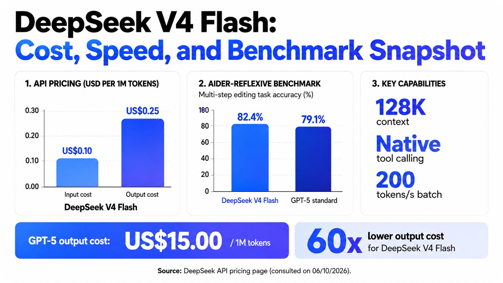

By an IITM student, researcher, and agentic AI enthusiast who got tired of paying absurd amounts for ChatGPT and Claude subscriptions

June 2026. If you are still paying more than fifty cents per million output tokens in any agentic pipeline, forgive my frankness: you are literally burning money. No, this is not an exaggeration on my part, but simply the relationship between API costs and absurd usage — because, indeed, LLMs should be used absurdly, whether you are a solo researcher like me or a startup. And here, the reason has a name, surname, and version: DeepSeek V4 Flash. And what it represents goes far beyond excellent benchmark results — it represents the consolidation of a trend that demonetizes the already psychologically consolidated commercial models and pushes the center of gravity toward SLMs, the highly specialized Small Language Models.

I have been monitoring price-per-token curves since the time when we thought it was normal to use a model like GPT-4o, which, by the way, was the first major model I used. With every Claude model released, I have been monitoring the relationship between token cost and benchmark performance, and comparing it with Chinese models. In an academic and professional context where we seek to maximize the efficiency of our activities — whatever they may be — we tend to be drawn toward what feels like magic: the DeepSeek V4 line.

The official numbers from DeepSeek itself, from its API pricing page, consulted on 06/10/2026, show:

The price delta is 60 times. Sixty. The point is not that GPT-5 is bad; it is that what we previously considered "quality" — commercial LLMs — no longer fits that category, which means that any price above US$0.50 per 1M output tokens has become unnecessary.

The DeepSeek phenomenon is not isolated. The Chinese ecosystem has embraced the strategy of saturating the market with SLMs of extremely high task-specific efficiency. While the West is still discussing whether agents need ever-larger models, laboratories in Hangzhou and Beijing are already packaging SLMs for industrial tasks.

The best example I have tested so far is Qwen3-Coder-Next, released in April 2026. The model has only 3.8B active parameters, with a MoE architecture totaling 7B parameters, and was trained exclusively for multilingual code generation and editing. It is not meant to discuss philosophy, summarize emails, or plan trips, but in code, it is a major specialist.

This model crystallizes what I define as an SLM in the agentic era: it is not simply a small model, but a model with strong task alignment, trained on high-quality synthetic data and reinforced by specific RL, namely RLHF applied to tool use, debugging, and bug correction. According to its technical paper, 80% of Qwen3-Coder-Next's gains came from the curation of coding-agent trajectories, not from the model's size. In other words, its differentiator lies in specialization — an excellent coder, by the way — and because it is a specialist, its cost and number of parameters drop drastically compared with already traditional commercial LLMs.

The trend I observe in benchmarks points to a clear convergence: by 2027, the standard model for industrial agentic AI will be based on specific SLMs, orchestrated by a slightly larger — and cheap — "conductor" model.

First, the bottleneck of agents in production is not the raw reasoning capacity of the LLM, but reliability in repeatable tasks: calling APIs, extracting schemas, filling spreadsheets, generating queries. An SLM trained for a closed domain gets more things right and consumes fewer tokens — here already lies the benefit of using SLMs.

Second, the cost of fine-tuning also collapses. Tools such as DeepSeek-DistillKit and Qwen-Factory make it possible to generate a specific SLM from a teacher model, such as V4 Flash, in under 48 hours, using datasets of 10,000 examples and a single A100 GPU, which you, like me, can rent with perfect convenience on Runpod. The inference ecosystem for SLMs has also exploded: runtimes such as llama.cpp, vLLM, and the new ExoEngine deliver throughput of 300 tokens/s for 3B models on consumer hardware.

Third, China understood the rules of the game earlier and is flooding the market with SLM families focused on "industrial agents": Qwen-Agent, DeepSeek-Agent, Baidu Ernie-Lite-Tool, ByteDance Seed-Executor. These models are released with permissive licenses, API prices below US$0.30, and tool benchmarks that already surpass the generalist models of 2025.

Setting a ceiling of US$0.50 output per 1M tokens is not merely a favor I did for my wallet, but a survival habit for every student, every researcher, every entrepreneur, every person who, ultimately, works on building agentic systems. Above fifty cents, you are fully burning your money — perhaps because you want to brag about being a Claude user, like iPhone users do, or perhaps simply because you do not know the real power of SLMs.

In 2026, the best model for agents is not the most famous one, nor the one with the highest benchmark score. It is the one that delivers the best cost-benefit ratio. And when I look toward 2027, I see a scenario in which the overwhelming majority of agents in factories, hospitals, and offices run on SLMs. Whoever realizes this first will have a pleasant surprise in their budget, whether they are a solo professional or a company.

---

*Partnerships and projects:* contact@antoniovfranco.com
