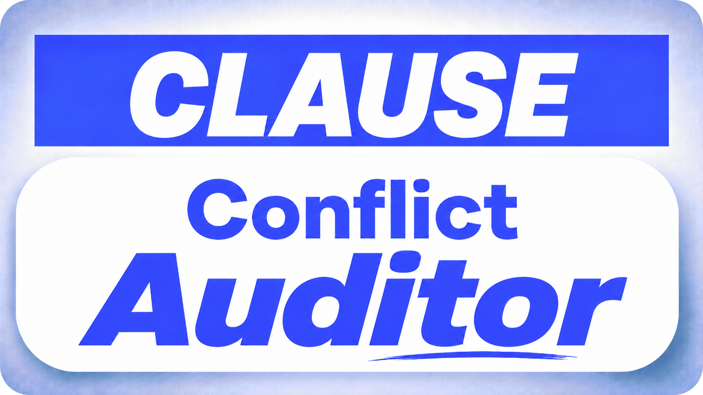

Manual contract review is one of the most labor-intensive activities in legal ops, compliance, and procurement departments. Typical corporate contracts span dozens of pages, with obligations, rights, and exceptions distributed not only across numbered clauses, but also across appendices, preliminary definitions, and general provisions that mutually reference one another. Verifying whether a specific obligation — such as a maximum response time for critical incidents or the existence of a reciprocal confidentiality clause — is present, absent, or contradicted requires the reviewer to locate all potentially relevant passages and reason carefully about their combined meaning, which makes the process slow, costly, and susceptible to interpretive variation among different professionals.

It is in this context that the Clause Conflict Auditor was conceived as an enterprise prototype for auditable contract screening ([you can check it out on Hugging Face, using it through the Gradio interface](https://huggingface.co/spaces/AntonioVFranco/clause-conflict-auditor)).

Its main function is to receive a contract and a set of hypotheses about contractual obligations and determine, for each one, whether it is supported by the text (Entailment), contradicted (Contradiction), or simply not mentioned in a decisive way (NotMentioned). The major distinction of this tool compared to a common classifier is that each decision must be accompanied by the specific clause that supports it and by a textual justification produced by a deterministic layer, forming an evidence trail that allows a human reviewer to verify, challenge, or endorse the result in a matter of seconds.

The project’s objectives are divided into three interconnected fronts.

On the technical level, the goal was to orchestrate a Legal NLP pipeline that integrates text extraction, structural segmentation, candidate clause retrieval, NLI inference, an aggregation rule, a deterministic verifier, and a relevance portal for contradictions. On the business level, the goal is to reduce the time required to verify recurring checklists, allowing the professional to focus analysis on higher-risk clauses and exceptions instead of spending hours on repetitive checks. On the safety level, a clear philosophy was established: it is preferable to preserve a false alarm (over-flag) than to risk suppressing a real conflict, which is why the system was rigorously validated to present zero dangerous false negatives.

The results synthesized throughout this report attest to the feasibility of the approach. Across a set of 50 hypotheses distributed over 10 synthetic contracts, the system achieved 96% label accuracy and 90.2% citation accuracy, with an average processing time of 11.86 seconds per contract in a batch of five hypotheses. However, it is essential to make explicit from the outset that this is a prototype validated in a controlled environment, that it does not replace legal advice, and that it should not be used with confidential documents in its public version.

## Architecture

The heart of the Clause Conflict Auditor is a sequential pipeline composed of independent modules, yet strongly coupled in terms of data flow. The process begins with text extraction from the uploaded file — whether it is a simple `.txt`, Markdown, PDF (via the pypdf library), or DOCX (via python-docx) — followed by a normalization step to remove formatting noise that could compromise subsequent stages. The normalized text is then submitted to a structural segmenter that divides it into coherent clauses or paragraphs, using heuristics based on numbering, line breaks, and common delimiters in contracts. This segmentation is not merely operational; it is the sine qua non condition for the final citation to point to a precise textual unit that can be verified by a human.

After the textual preparation stage, the pipeline performs candidate clause retrieval for each hypothesis. Comparing the hypothesis with the entire contract would be inefficient and would dilute the semantic signal, since most clauses address topics unrelated to the investigated question. To solve this, a TF-IDF mechanism combined with cosine similarity is used, ranking the extracted clauses according to lexical overlap with the terms in the hypothesis. Only the highest-scoring clauses proceed to inference, which drastically reduces the computational load and isolates thematic noise. This approach, however, carries a known vulnerability: lexical similarity can elevate clauses that share generic terms with the hypothesis (such as “parties”, “contract”, “obligation”), but whose semantic content is only tangentially related, which motivated the creation of a specific corrective layer in the final phases of the pipeline.

For the inference itself, the system employs the `cross-encoder/nli-deberta-v3-base` model, a pre-trained Natural Language Inference (NLI) model that receives as input the pair formed by the candidate clause (premise) and the hypothesis (thesis) and produces three normalized scores for the entailment, contradiction, and neutral classes. Unlike bi-encoder models, which encode the sentences separately, the cross-encoder processes the pair jointly, capturing more refined syntactic and semantic interactions, resulting in higher precision for the textual inference task. In the contractual domain, we map the neutral label to "NotMentioned", because for screening purposes, the relevant distinction is whether the contract supports, contradicts, or remains silent about the obligation, not whether there is a neutral relationship in the abstract.

The final decision is not made based on a single isolated clause, but rather through the aggregation of the results obtained for all candidate clauses of the same hypothesis. The decision rule applies confidence thresholds to the NLI scores — discarding labels with low probability — and establishes the principle of local neutral dominance: a clause that produces neutral cannot veto the decision from another clause that presents decisive entailment or contradiction, as this would generate an excess of false negatives. The most decisive clause among all candidates is then selected as the “citation” that accompanies the final label, ensuring that the evidence trail points exactly to the passage that supported the conclusion.

Complementing machine-learning-based inference, two deterministic layers act as safeguards. The first is the _verifier_, which inspects the decision and the selected citation, identifying cases of “weak citation” (clauses that are excessively short or peripheral) and adjusting the label when necessary, while also recording in the `verifier_reason` field the justification for the eventual correction. The second and most recent is the _contradiction relevance gate_, which operates specifically on Contradiction decisions. During the initial validation, it was observed that the system frequently labeled hypotheses as contradicted based on clauses that, although they shared generic terms, addressed distinct contexts (for example, "response to general requests" versus "response to critical incidents"). The gate resolves this by requiring the cited clause to share the central tokens of the hypothesis — not merely generic terms — and, when this does not occur, it falls back to Entailment (if there is another suitable clause) or reassesses the decision. Crucially, the gate never downgrades to NotMentioned, because that would amount to suppressing a possible conflict, violating the project's safety philosophy.

## Interface, Usage Modes, and Features

The application provides two operational modes that address different verification needs. In _Simple audit_ mode, the user enters the contract (by upload or pasting) and a single hypothesis, immediately receiving the label, the cited clause, the confidence scores, and the verifier’s reasoning. This mode is ideal for spot checks, technical demonstrations, or the manual validation of a specific obligation that has just been raised in a negotiation meeting. The _Batch audit_ mode, which constitutes the true business use case, allows the upload of a CSV file containing dozens or hundreds of hypotheses, which will be processed against the same contract in a single execution, generating a consolidated table with all corresponding decisions and evidence.

The results table generated in batch mode is the nerve center of auditability. Each row displays the original hypothesis, the final label assigned (Entailment, Contradiction, or NotMentioned), the exact clause from the contract that served as the citation, the confidence scores, and, most importantly, the `verifier_reason` field, which documents whether there was deterministic intervention and what logic was applied. This layout allows a human reviewer to move vertically through the hypotheses, quickly checking decisions that seem doubtful without having to redo all the manual search work. In addition, the table is accompanied by export buttons that generate files in three different formats: CSV, for tabular analysis and integration with spreadsheet systems; JSON, for programmatic interoperability and preservation of the complete structure; and Markdown, for inclusion in due diligence reports or audit documentation.

Input flexibility is another point of value. In addition to plain text, the system accepts contracts in Markdown, PDF, and DOCX, covering almost all formats in which these documents are distributed in the corporate environment. It is worth noting, however, that PDF extraction depends exclusively on the file’s native text layer; PDFs originating from scans without optical character recognition (OCR) are simply not processed, a limitation that will be addressed later. The combination of these features — usage modes, auditable table, and multifaceted export — turns the prototype into a practical tool for professionals who deal with large volumes of contracts and need an initial filter to guide their analytical efforts.

## Validation, Metrics, and Error Analysis

The validation of the Clause Conflict Auditor was conducted across multiple layers to ensure that reliability was not limited to the superficial behavior of the interface. First, an automated pytest suite totaled 94 passing cases, covering individual components such as segmentation, decision rules, the verifier, and the relevance gate logic. Second, a QA battery was executed in an isolated Kaggle environment, reproducing the pipeline from extraction to export, with a final “PASS” result, ensuring code reproducibility outside the development environment. Third, a smoke test was triggered directly against the Space published on Hugging Face, confirming that the application behaves in the real deployment environment consistently with the local tests.

The most comprehensive effort, however, was the _product validation pack_, composed of 50 hypotheses distributed across 10 synthetic contracts, with _ground truth_ manually defined for each hypothesis-contract pair.

Before the introduction of the relevance gate, label accuracy stood at 84.0% and citation accuracy at 80.5%, with eight over-flag cases (false contradictions) caused by the thematically tangential clauses mentioned earlier. After the implementation of the gate, label accuracy rose to 96.0% and citation accuracy to 90.2%, with six of the eight cases corrected and no introduction of dangerous false negatives. In addition, the system presented zero dangerous false positives and zero dangerous false negatives throughout the validation, confirming that prioritizing safety did not come at the expense of precision. The average processing time per contract, in a batch of five hypotheses, remained at 11.86 seconds, perfectly tolerable for a screening workflow.

The two residual over-flag cases that persisted — identified as H015 and H045 — deserve explicit analysis so there is no illusion of perfection. In H015, the system maintains a contradiction where the expected label would be NotMentioned, because the correction would require a direct downgrade from Contradiction to NotMentioned, an operation the gate deliberately avoids because it is precisely the kind that could generate false negatives in other contexts. H045, in turn, involves a semantic distinction related to support level (SLA tiers) that exceeds the capacity of a gate based on central-token overlap, requiring finer inferential reasoning about service hierarchies. Both are safe in the sense that they do not conceal a real conflict; they are merely excessive alarms that a human reviewer can readily discard upon examining the presented citation.

## Added Value, Limitations, and Privacy

The Clause Conflict Auditor offers tangible benefits on three main fronts. For legal ops, it acts as a preliminary triage tool that reduces lawyers’ workload, allowing them to receive contracts already flagged with high-risk clauses highlighted and substantiated. For procurement, the tool standardizes the verification of recurring checklists — such as the presence of liability limits or SLA deadlines — ensuring that all vendors are evaluated under the same objective criteria. For compliance, the ability to process dozens of hypotheses in batch against the same contract accelerates the identification of violations of specific regulatory obligations, transforming what would be a manual sweep of hours into a screening process of seconds.

Nevertheless, the system’s limitations are explicit and must be communicated with the same emphasis as its virtues. First, the Clause Conflict Auditor does not constitute legal advice; its decisions are technical and based on statistical inference, not a substitute for the critical analysis of a qualified professional. Second, validation was conducted exclusively with synthetic contracts, which, although inspired by real clauses, do not reproduce the complexity, idiosyncrasy, and cross-references present in authentic corporate documents. Real contracts may present nested structures, excessively dense language, or chained conditionals that challenge the current heuristics. Third, because the NLI model is pre-trained on general corpora and not specifically on legal corpora, it may assign high confidence to incorrect decisions, especially in passages with multiple negations or context-dependent definitions, which is why the deterministic layers were added, although they do not eliminate the fundamental risk.

The question of privacy is particularly sensitive in the public Space environment. Any contract uploaded to the application hosted on Hugging Face passes through the platform’s infrastructure, which makes the use of confidential, strategic, or commercially sensitive documents absolutely inadvisable. For organizations wishing to adopt the tool in production, the natural path is private deployment in controlled infrastructure, with strict access and data retention policies — or, alternatively, local execution of the source code, which is public and allows full isolation of the processed data. Non-persistence of documents beyond the current session is a principle adopted in the design, but in the public environment, the transmission itself already constitutes an exposure vector that must be managed responsibly.

## Outlook

The Clause Conflict Auditor reached, with commit `f9ef2a2649bd13884a279760f27ce04e9c26c964`, the status of a demonstrable and rigorously validated enterprise prototype. Development followed evidence-oriented incremental cycles: it began with a base pipeline using extraction and NLI, advanced to batch modes and export, and finally incorporated the relevance gate as a direct response to validation findings. Each stage was supported by a battery of tests and by checks in isolated environments (Kaggle) and real environments (Hugging Face Space), ensuring that functional evolution did not compromise stability or safety. The fundamental technical decisions — such as choosing a zero-shot model instead of legal fine-tuning, using Gradio for the interface, and prioritizing the evidence trail over mere classification — arise from the understanding that, in a high-risk domain such as contracts, transparency and auditability are worth more than a marginal increase in accuracy obtained through opaque means.

The path forward points toward the transition from the synthetic environment to the real one. The next logical steps involve running a pilot in a private environment, with real contracts anonymized or duly authorized, so that the system’s performance can be measured under authentic operational conditions and thresholds can be calibrated based on specialized human feedback. If the semantic complexity of real contracts exceeds the capability of the current model, replacing or fine-tuning the NLI component for the legal domain may be evaluated, although this would require a considerable labeling and training effort. Regardless of technical evolution, the project’s central philosophy remains unchanged: to transform textual inference into a traceable process, in which every decision can be verified, questioned, and documented, and where safety against false negatives prevails over the pursuit of absolute precision.

In summary, this report documents not only a functional application, but an approach to building responsible AI tools in high-consequence contexts. The Clause Conflict Auditor demonstrates that it is perfectly feasible to orchestrate pre-trained language models with deterministic layers and explicit business rules to generate immediate practical value, provided that one maintains an attitude of radical frankness about limitations and an uncompromising commitment to evidence and reviewability. It is in this spirit that the project makes itself available to the technical and business community for discussions, criticism, and collaborations that can further improve it.

---

*Partnerships and projects:* contact@antoniovfranco.com
