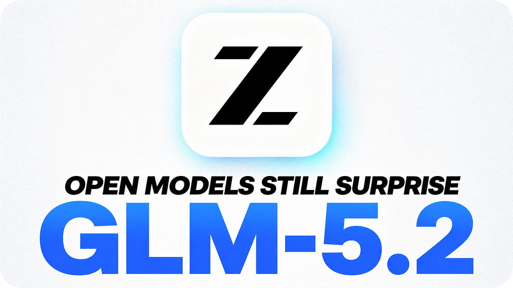

Honestly, it had been a long time since a model surprised me like this — not since the end of 2025.

No, I do not mean it surprised me because I liked a response or was impressed by a benchmark. No, and in this article you will understand where I am going with this.

I remember the launch of Sonnet 4.5 as if it were yesterday. It was one of those moments when the developer community noticed a considerable leap in quality across all existing models — and, make no mistake, the qualitative leap was undeniable. Deeper reasoning, almost human contextual understanding, truly functional code in complex projects. In my head, I said: "Damn! I do not need anything better." And, in a way, that was not an exaggeration. Sonnet 4.5 elegantly solved problems that previously required workarounds and patches.

That feeling of sufficiency repeated itself with the following open-source models. Then came the Qwen-3.5 family of models — excellent models, by the way! — each version pushing the limits of what was possible with a cost-benefit ratio that truly challenged what we had understood until then as common sense. Qwen3-Coder-Next, specifically, made me realize just how powerful and cheap a model can be — and understand, as I pointed out in this article, that the future of models in the industry will be SLMs. Soon after, the DeepSeek V4 models, although without as much fanfare — the community had expected their release during Chinese New Year, which did not happen — arrived commanding respect, despite the delay. With each release, I had the exact same certainty: we had reached the top of what was satisfactory for a developer. There was nothing left to evolve in what truly mattered for my daily work.

Ah… Pure mistake. And thank God it was a mistake.

When I put GLM-5.2 to work, my first reaction was: "Is it really all that?" The answer came when I analyzed the work it generated. A level of code quality and efficiency that, if there had been any doubt that a model could surprise me more than Sonnet 4.5 and its peers, that doubt vanished completely. At that moment, I understood that there was indeed room — plenty of room — for something to impress me beyond everything I had experienced.

The most fascinating part is that this perception did not come from a closed, extremely expensive, inaccessible model — ah, Fable 5… so good and so expensive… It came from a model running on infrastructure managed by a service that has already become trivial for developers. And this brings us to the elephant-in-the-room question: how close are we, those of us who bet on open models, to having in our hands a Chinese model with capabilities comparable to those of Fable 5?

The answer, surprisingly, is: closer than the proprietary software industry would like to admit. Fable 5 symbolizes, for many, the ceiling of what a closed model can offer: multimodal reasoning, analytical depth, and a veneer of almost antiseptic alignment. But, when testing GLM-5.2 side by side with DeepSeek V4 Pro and Flash variants, and with the latest weights from the Qwen-3.5 family, it becomes evident that the gap is visibly narrowing — and not through imitation, but through independent research paths. Open Chinese models are not merely keeping up; they are defining new frontiers in inference efficiency, knowledge compression, and adaptation to consumer hardware.

And what about costs? Here lies one of the pillars that makes this discussion inseparable from the defense of open artificial intelligence. GLM-5.2 can be run via Ollama Cloud with inference costs that, in many scenarios, fall below a few cents per million tokens — orders of magnitude lower than what one pays to access Fable 5 or other closed models. DeepSeek V4 Pro and Flash follow the same philosophy, with prices that allow an independent researcher like myself to run experiments that previously would have required an excellent corporate budget. The Qwen-3.5 family, in turn, is available in such a wide range of quantizations that it can be adjusted to run on a home GPU, no joke. Fable 5, by contrast, remains under the yoke of premium subscriptions, usage fees, and an access policy that decides, for you, what you are allowed to investigate.

This is exactly where I need to defend something that transcends benchmarks and cost spreadsheets. Artificial intelligence must be open and free to every human being, regardless of the use one intends to make of it. It is about understanding that real progress — the kind that distributes power instead of concentrating it — only sustains itself when the most transformative tools are free and universal.

Some will argue that total openness is dangerous, that certain uses require control and barriers. I disagree, with the conviction of someone who observes history. The conscious and ethical use of intelligence is not born from foolish laws that hinder more than they protect, nor from restrictions that presume bad faith as the default. It is born from the evolution of the principles of human society, from the collective maturation that occurs when people have unrestricted access to knowledge and can experiment, make mistakes, and correct their course in public.

Seeing GLM-5.2 operate with perfect naturalness reminded me that genius is not the monopoly of a laboratory, a country, or a business model. Genius is distributed, and the only way to honor it is to ensure that minds around the world can access it, modify it, and improve it without asking for permission. What Sonnet 4.5, Qwen3-Coder-Next, and DeepSeek V4 proved in the past — and what GLM-5.2 now proves — is that the open ecosystem is not an inferior alternative to the closed one; increasingly, it is the vanguard.

I thought Sonnet 4.5 and similar open models were enough. Fortunately, I was wrong. And, if the current pace continues, I will soon look at Fable 5 with the same distant admiration with which we look at a powerful relic.

---

*Partnerships and projects:* contact@antoniovfranco.com
