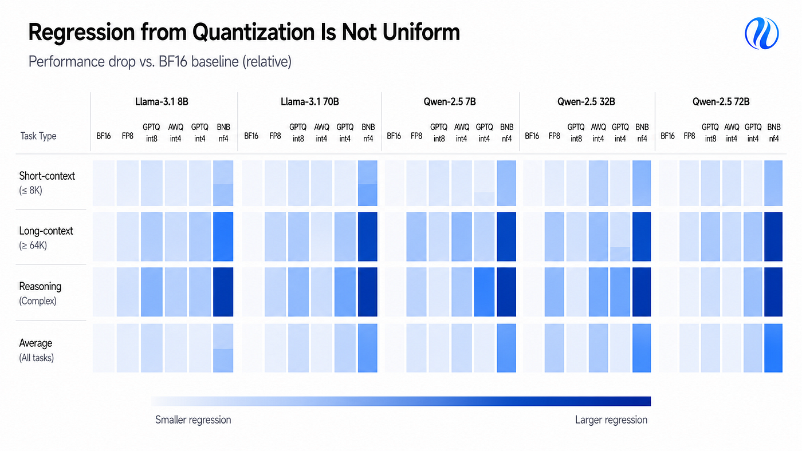

When I started designing how quantization should work in Huyawo, the first question was the most obvious one: how much could I reduce the size of a model without compromising its quality?

It’s a good question, that’s true, but I realized it wasn’t enough.

Normally, quantization is presented as a compression problem. You start with a model in FP16 or BF16, convert its weights to 8 or 4 bits, and compare the result with the original. If the model starts consuming much less memory, continues scoring well on the selected benchmarks, and does not show a very large increase in perplexity, the tendency is to consider the conversion successful.

The problem is that none of these signals, in isolation, answers the question that really matters in production: does the quantized model still do well what I had chosen the original model to do?

This difference significantly changed the way I started thinking about quantization.

In theory, reducing weights from 16 to 4 bits decreases the space used to store them by approximately four times. Total memory consumption during inference does not fall by exactly the same proportion, because the system still needs to deal with activations, KV cache, quantization scales, and other structures. Even so, the savings you can achieve can be substantial. In some cases, they are precisely what makes it possible to put a model on a smaller GPU or run locally something that previously required a more expensive machine.

That’s why techniques such as GPTQ and AWQ have become so important. Their goal is to make this reduction while causing as little damage as possible to the model’s behavior. A quantized version can look practically identical to the original model on one benchmark and perform much worse on another. In an evaluation published in 2025 with Llama and Qwen models, for example, 8-bit quantization caused relatively small losses in long-context tasks, while some 4-bit configurations showed much larger regressions. In certain cases, the drop reached 59%.

What interests me in this result is not the extreme number itself, but rather the fact that the regression is so uneven.

There is no simple rule according to which “4 bits costs X% of quality.” The effect depends on the model, the quantization technique, the calibration, and the type of task being evaluated. The same method can preserve one capability very well and noticeably degrade another.

That’s why, for me, the question stopped being “does quantization work?” and became something much more specific: does this quantization preserve the capabilities I need, in this model and in the runtime where it will actually be used?

## What Really Changes When a Model Goes to 4 Bits

A weight stored in FP16 can assume an enormous number of possible values within a given range. When it is represented in 4 bits, this variety is drastically reduced, meaning that only 16 levels become available within each quantization group. This means that weights that originally had different values need to be approximated to the same level.

In simplified terms, the quantizer determines a scale and maps the original weights to the discrete values that can be represented. During computation, these values are interpreted again using that scale.

The reconstructed weight remains close to the original, but it is not identical to it — this difference is the quantization error.

If all weights were equally important to the model’s behavior, it would be enough to minimize this error uniformly. Transformers, however, do not behave this way. There are weights, channels, and regions of the network that have a much greater impact on the output.

AWQ starts precisely from this observation. Instead of treating all weights in the same way, the technique uses the model’s activations to identify more sensitive channels and tries to protect them during quantization. GPTQ follows a different strategy: it uses an approximation of second-order information to choose the adjustments that introduce less error as the weights are quantized.

These techniques help a lot, but they do not eliminate an important characteristic of the problem: a small error in the weights can produce a behavioral difference much larger than its numerical size would suggest.

This happens because LLMs generate text autoregressively.

At each step, the model calculates a probability distribution for the next token. Imagine that two tokens are almost tied. A very small change in the logits may be enough to change which one is selected. The initial difference may be minimal, but the selected token becomes part of the context used in the next step. From that point on, the two executions no longer have exactly the same input sequence. As generation continues, this difference can accumulate.

That’s why you cannot conclude that a small change in the weights will necessarily produce a small change in the final response, just as you cannot assume that this change will appear uniformly.

A model may continue answering short questions very well and show a much larger regression when it needs to retain information across tens of thousands of tokens. It may preserve conversation and writing, but get worse at certain types of reasoning. Recent studies on aggressive quantization found exactly this kind of behavior: some capabilities remain relatively stable while others suffer much clearer losses.

This is also why I do not consider perplexity sufficient to decide whether a quantized model should replace the original.

Perplexity measures something important: how good the model is, on average, at predicting the next token on that dataset. But that does not mean it represents what the model needs to do within a specific application.

If I’m using an LLM to generate valid JSON, I want to know whether the quantized version continues to respect the schema. If the system works with very long documents, I want to know whether the ability to use context remains stable. If a particular class of reasoning is important to the product, it needs to appear directly in the evaluation.

A general metric can remain practically unchanged while a capability that actually matters gets worse.

## A Smaller Model Is Only Better If It Continues Doing the Job

The approach I started considering safer is to treat the original model as a baseline and the quantized version as a new candidate. I do not want to evaluate only whether the 4-bit model looks good. I want to know what changed compared with the model that had already been considered suitable.

This requires controlling the comparison.

The prompts need to be the same. The tokenizer needs to be the same. The generation settings as well. The criterion used to judge the response cannot change from one execution to another.

First I run the baseline.

Then I apply quantization.

Then I compare the two.

The difference matters because an isolated score can look good and still hide a regression.

Imagine a model that gets 80% of an evaluation set correct in FP16 and 79% after quantization. The first impulse would be to consider this difference irrelevant, but the average alone does not show where that one percentage point came from. It may be that the drop is distributed almost imperceptibly across the entire set. It may also be that the model preserved practically all the simple tasks and got much worse precisely on a small subset that is essential to the system.

In both cases, the final average would be similar, but the production decision should not be. That’s why I started looking with more interest at quantization evaluations that analyze several datasets and different types of capability. A study on the generalization of quantized LLMs evaluated more than forty datasets and found results showing how the choice of calibration data and method can significantly change the final result.

The number of bits is only one part of the problem, because the source model, the technique used, how calibration was done, and the type of behavior being measured also matter.

And there is still one issue that quality benchmarks, by themselves, do not solve: the reason for quantizing a model is to obtain some operational advantage.

In other words, if the 4-bit version consumes less memory but does not improve execution in a meaningful way in the environment where it will be served, the transformation may not be worth it.

Weight-only quantization, for example, greatly reduces the amount of data that needs to be moved from memory during certain operations. This can improve inference speed, but the gain depends on whether the hardware and runtime have kernels prepared for that format.

AWQ is a good example of this. The quantization technique is part of the story, but practical performance also depends on kernels capable of exploiting the reduced representation. A checkpoint taking up less disk space does not automatically mean it will respond faster.

Do you see what I mean? That’s why I don’t like using “now it fits on the GPU” as the conclusion of a quantization experiment. I want to know how much memory was actually saved during inference. I want to measure latency and throughput. I want to know whether the runtime is taking advantage of that format. And, most importantly, I want to place those gains alongside the quality regression.

If I save a lot of memory, but latency gets worse, I need to understand whether that tradeoff still makes sense.

If I gain a lot of throughput and the quality loss is small precisely in capabilities that are not critical to the application, the quantization may have been excellent.

The point is that there is no universal answer. The decision depends on the tradeoff that specific candidate offers. This distinction ended up significantly influencing the architecture I’m developing in Huyawo.

Quantization is still part of the adaptation and compression layer I’m developing, but from the initial design I did not want the process to simply end with the creation of a new checkpoint.

I want to preserve the identity of the source model, record how calibration was done, know the runtime constraints, and keep evidence of the regression caused by the transformation.

Ah! Most importantly: transformation and promotion are different decisions.

A quantization process can end technically without error and still produce a model that I do not want to put into production.

In Huyawo’s current design, the qualification stage can result in PROMOTE, REJECT, ROLLBACK, or BLOCKED. This separation may seem excessive while everything is working. It starts to make sense when a smaller, cheaper, and apparently equivalent model loses exactly a capability that was important to the application.

## Quantization Needs a Regression Contract

Another decision I started considering important is defining the acceptance criteria before looking at the result. If I decide what is acceptable only after seeing the numbers, it becomes very easy to adapt the interpretation to the candidate I have just produced.

Suppose I expected a loss of at most 1%, but the model lost 2%. After seeing the result, I may conclude that 2% is still not that bad. If another task gets 4% worse, I can say that perhaps that task was not so important. If the speed gain is lower than expected, I can start emphasizing memory reduction.

None of these justifications necessarily has to be dishonest. The problem is that the criteria start moving along with the result. After some time, it is no longer clear whether I am evaluating the model or trying to find a reason to accept it.

That’s why I like the idea of a regression contract.

Before quantization, I define what needs to remain true. If a certain capability needs to maintain at least a specific score, I record that threshold. If the transformation is only worth it when latency falls below a certain value, that also needs to be defined beforehand.

This contract does not need to be huge. In fact, I prefer that it isn’t.

A real application generally depends on a relatively small set of capabilities. Running fifty benchmarks just to produce a larger table does not automatically make the evaluation more useful. What I want to measure is what would actually justify approving or rejecting the new candidate.

This way of working also helps a lot when something goes wrong. If the 4-bit version fails a criterion that the baseline met, the problem becomes clearer.

Perhaps four bits are too aggressive for that model.

Perhaps another quantization method preserves the lost capability better.

Perhaps some layers need to remain at higher precision.

Perhaps the model is fine and the problem is only in the runtime implementation.

When the baseline, configuration, and criteria are known, these hypotheses can be investigated separately. Without this discipline, everything ends up mixed together in a single vague question: “did the model turn out well?”

## Conclusion and Recommendations

Today, generating a quantized version of an LLM is relatively simple.

Libraries such as Transformers already offer integrations with different quantization techniques, and tools such as bitsandbytes make it possible to load models in 8 or 4 bits with few changes to the code. NF4, for example, became known mainly for its use in QLoRA and was developed to represent common distributions of neural network weights more appropriately.

That’s why the hardest part of the problem is no longer necessarily producing the quantized checkpoint, but rather deciding whether that checkpoint deserves to replace the original.

To make this decision, I follow five principles:

- I establish the baseline before quantizing;

- I define the regression limits before knowing the result;

- I directly evaluate the capabilities the application depends on;

- I measure the gains in the runtime where the model will actually be used;

- I treat the quantized version as a new candidate that needs to be qualified.

The last point is what changed the way I think about quantization the most.

Technically, I am compressing an existing representation.

From a production standpoint, however, it does not make sense to assume that I am still dealing with exactly the same model. The weights changed. The numerical error changed. Some generation decisions may change. And the distribution of these differences across the model’s capabilities is not uniform.

That’s why I prefer to treat the quantized version as another candidate. If I can show that it preserves what really matters and delivers a clear operational advantage, I have a good reason to promote it.

If I cannot demonstrate that, knowing that the model now uses much less memory is still a useful result.

It just isn’t, by itself, a justification for putting it into production.

*Partnerships and projects:* [contact@antoniovfranco.com](mailto:contact@antoniovfranco.com)
