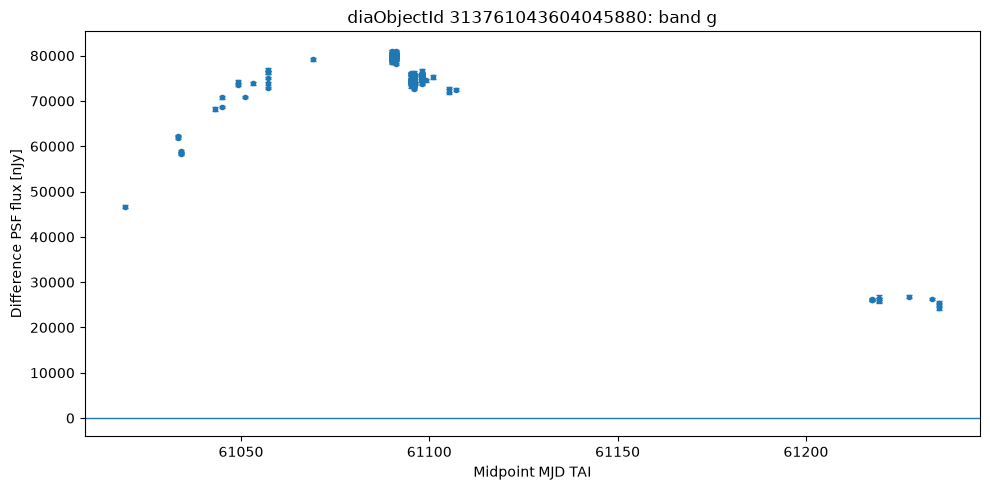
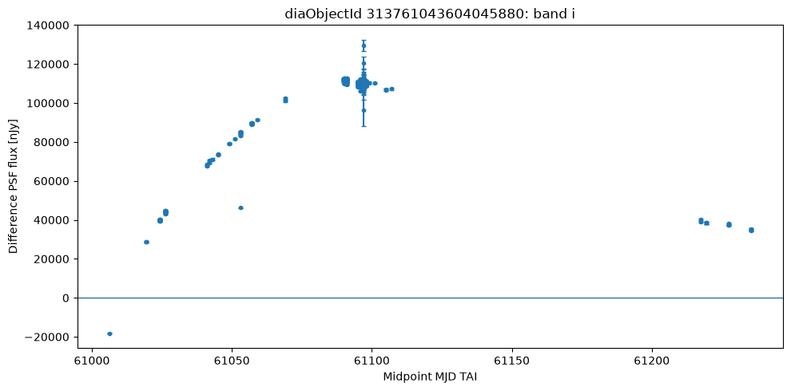
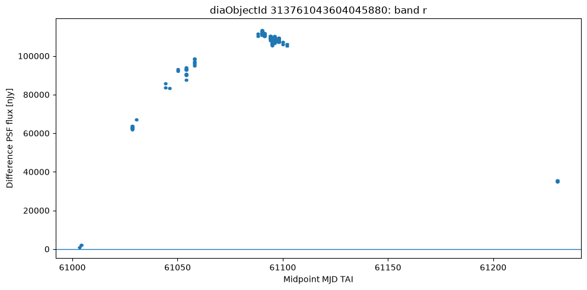
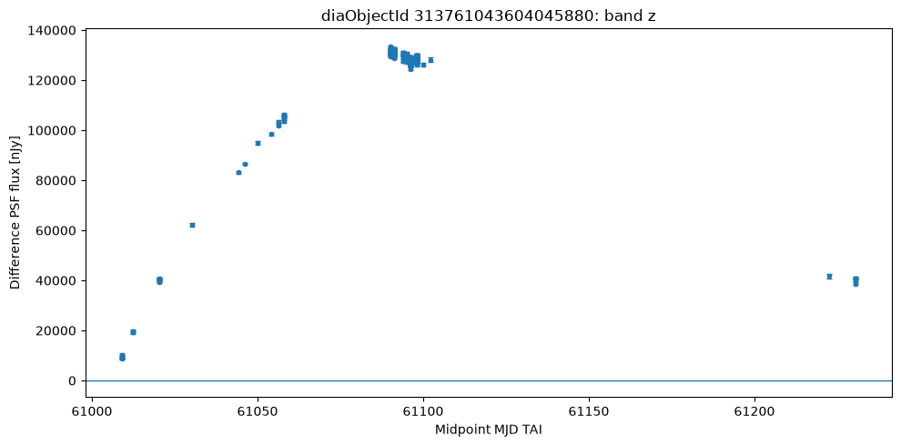
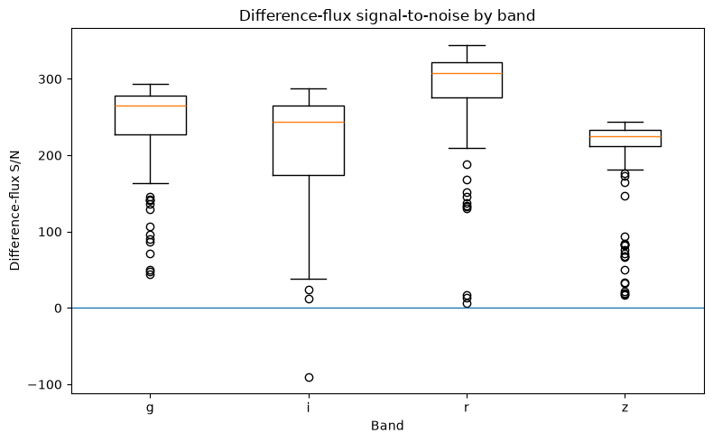
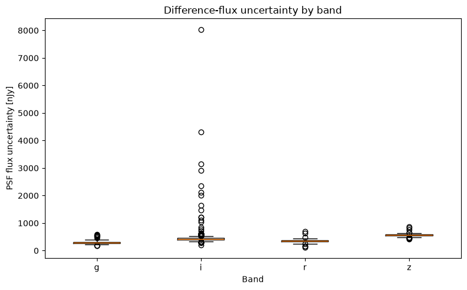
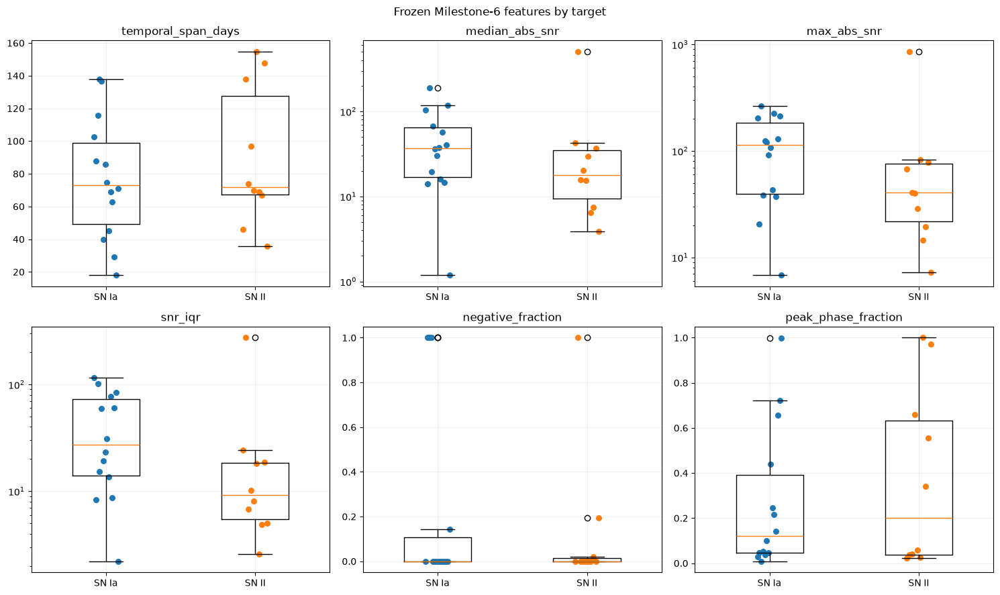
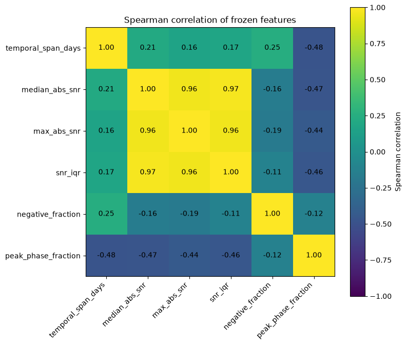
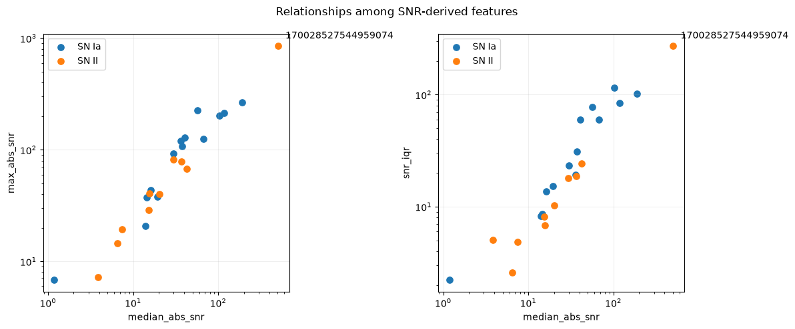

I used Fink's public services to build a set of supernovae with external
labels and test a simple question. With complete Rubin light curves
summarized into a few variables, is it possible to usefully separate SN
Ia from SN II?

The path to the model ended up being more important than the model
itself. The historical search found 172 objects in the two classes of
interest, but only 24 had enough measurements to enter the final
experiment. Those 24 objects totaled 3,872 measurements.

The logistic regression achieved a ROC AUC of 0.414 and an average
precision of 0.522. A shallow Random Forest raised those numbers to
0.521 and 0.650, but worsened balanced accuracy at the 0.5 threshold and
made more errors at that cutoff.

That was where the comparison became interesting. When I estimated
uncertainty using the same 24 objects, the intervals between the two
models still crossed zero. The Random Forest changed several numbers,
but the dataset was too small to support a clear victory.

## What I wanted to measure

Fink makes it possible to query Rubin alerts and measurements, but I did
not want to use ready-made classification outputs as model inputs. The
question was more restricted. I wanted to know how much separation
between SN Ia and SN II appeared in simple summaries of the photometry
itself and the observed time span.

The labels came from TNS through fields made available in the Fink
stream. The model inputs, on the other hand, came only from the original
Rubin measurements. This prevented a previous prediction from Fink
itself from being hidden among the variables and making the test
circular.

The unit of the experiment was the astronomical object. Each diaObject
could have dozens or hundreds of diaSources, but all measurements from
the same object had to remain together during evaluation.

This detail seems administrative until you look at the numbers. The
3,872 rows in the final dataset do not represent 3,872 independent
examples. They represent only 24 supernovae.

## Environment

The work was carried out on RunPod in an isolated project environment.
The record used during the modeling stage shows an NVIDIA RTX A5000 with
24 GB, Python 3.11.13, numpy 2.4.6, pandas 3.0.6, pyarrow 25.0.1, and
scikit learn 1.9.1.

The GPU was available, but it was not needed for the models in this
article. Both the logistic regression and the Random Forest were run on
CPU.

The notebooks were created in JupyterLab 4.6.4. The code that became a
stable part of the project was kept separate from the notebooks so that
the interactive analysis did not need to carry all the transformation
logic along with it.

## Before ML, I needed to understand the difference flux

Before building the set of 24 objects, I started with a single diaObject
and 693 measurements. It was useful for understanding what the fields
meant in practice and, above all, why the bands should not be mixed into
a single curve.

The object covered 232.08 days. In the four bands with good coverage,
the difference flux started at lower values, passed through a high state
around MJD 61090 to 61105, and then returned to much lower values in the
late observations.

Caption. Difference flux in the g band of the exploratory object used
before the classification stage.

Caption. Difference flux in the i band. The only negative measurement in
this set appears in this band.

Caption. Difference flux in the r band, which also contained the
object's highest absolute SNR value.

Caption. Difference flux in the z band over the same observed interval.

The median difference flux values differed across bands. The z band had
the highest median, but that did not mean it had the cleanest signal.
The highest median SNR appeared in r.

Caption. SNR distribution by band in the exploratory object.

Caption. Distribution of flux error by band. The uncertainty changes
considerably across filters and affects how the SNR is interpreted.

This first object also had a single measurement with negative difference
flux in the i band. I preserved that point and did not automatically
classify it as an error, because a negative value can arise from the
relationship with the reference image and is not, by itself, an invalid
measurement.

The lesson for the next stage was straightforward. High flux, high SNR,
or an unusual point do not identify a supernova class on their own. They
need to be evaluated within the complete set of measurements.

## How the dataset was built

The historical search began with objects associated with TNS. After
completing the planned interval, the census contained 2,968 Rubin
objects. Of those, 232 had an exact TNS type available and 2,736 did not
have a usable label.

Two classes exceeded the minimum defined before downloading the curves.
There were 126 SN Ia and 46 SN II, for a total of 172 candidates.

The curves were downloaded in nine batches using only original Rubin
fields related to time, band, and photometry. The download returned
4,736 diaSources. One hundred and seventy objects had at least one
measurement, and two returned no rows.

After that, the quality filter that had already been defined was
applied. An object needed to have at least 12 measurements, sufficient
coverage in more than one band, and at least five days between the first
and last valid observations.

The cutoff was strong. Of the 172 candidates, only 24 passed. The final
dataset contained 14 SN Ia and 10 SN II.

## Why 3,872 measurements became 24 objects

After filtering, 3,872 valid measurements remained. Viewed row by row,
the classes looked almost perfectly balanced. There were 1,939 SN Ia
measurements and 1,933 SN II measurements.

That balance is misleading if it is used as the sample size. The
thousands of rows are repeated observations of the same 24 objects.
Randomly splitting those rows between training and testing would cause
the same object to appear on both sides.

That is why all evaluation decisions were made at the diaObject level.
The measurements were used to build summaries of the curve, but the
number of independent cases remained 24.

The initial plan was to use a chronological split into training,
validation, and test sets. When I simulated that split, the five most
recent objects that would have fallen into the test set were all SN Ia.
The test set would have had no SN II.

I discarded that split instead of rebalancing it after looking at the
labels. With five objects, a single error would also change the overall
metric by twenty percentage points.

## How the evaluation was performed

The first model was a logistic regression with no hyperparameter search.
Before running it, six summaries per object had already been defined.
They condensed curve duration, SNR structure, frequency of negative
flux, and the relative position of the signal peak.

The main evaluation used leave one object out. In each of the 24 rounds,
one object was left out and the other 23 were used for fitting. Scaling
was also learned only from the 23 objects in that round.

The classification threshold was fixed at 0.5. It was not adjusted after
observing the results.

After the first model, I used 10,000 resamplings of the out-of-training
results to estimate the expected variation of the metrics within this
group. The comparison with the Random Forest used the same resamplings
for both models.

I also kept a separate chronological test. It used three progressive
windows with four evaluation objects in each. This part served as a
temporal stress test and was not mixed with the main metrics.

## What the six variables showed before the model

The analysis of the six variables already suggested that the problem
would not be simple. The observed duration had substantial overlap
between the classes, while the SNR-related variables were strongly
correlated with one another.

Caption. Distribution of the six variables by class in the final dataset
of 24 objects.

The fraction of negative measurements also had many zeros. The peak
position, meanwhile, occupied almost the entire possible range. None of
these variables appeared to provide a simple separation between SN Ia
and SN II.

Caption. Spearman correlation among the variables used in the models.

One object stood out in the SNR-related variables. diaObject
170028527544959074 was a very extreme SN II compared with the rest of
the dataset.

Caption. Relationship among the SNR-related variables. The extreme
object that would later produce the logistic regression's strongest
error already appears outside the group's usual pattern.

I did not remove this object, nor did I create a new rule after
observing this case. It was part of the defined dataset and ended up
becoming a good way to test the behavior of both models outside the more
common region of the variables.

## Overall result

The logistic regression finished with a ROC AUC of 0.414, average
precision of 0.522, Brier score of 0.296, and balanced accuracy of 0.593
at the 0.5 threshold. The log loss was 1.369.

The Random Forest finished with a ROC AUC of 0.521, average precision of
0.650, Brier score of 0.280, and balanced accuracy of 0.521. The log
loss fell to 0.781.

On the ranking and probability metrics, the Random Forest looks better.
At the fixed 0.5 cutoff, however, it performed worse in balanced
accuracy.

This difference also appears in the error count. The logistic regression
misclassified 9 of the 24 objects at the 0.5 cutoff. The Random Forest
misclassified 11.

Looking only at ROC AUC would make the comparison seem more favorable to
the Random Forest than it actually was.

## Logistic regression and the error that persisted across both models

The logistic regression confusion matrix showed a clear asymmetry. It
correctly classified 11 of the 14 SN Ia, but only 4 of the 10 SN II.

The ROC AUC of 0.414 was below 0.5. The average precision was 0.522.
These numbers are weak for a model that would need to serve as a
reliable classifier.

The most useful result came from one specific error. Object
170028527544959074, precisely the extreme case seen in the variable
analysis, was an SN II and received a very high score for SN Ia. This
error had a large impact on the log loss.

When I replaced the model with a Random Forest, the same object remained
misclassified. The probability of SN Ia was approximately 0.919.

This weakens a simple explanation that the logistic regression failed
only because it was linear. The nonlinear model also interpreted that
extreme pattern in the wrong direction.

## Random Forest with better numbers, but no clear victory

The Random Forest was intentionally small. I used 256 trees with a
maximum depth of 2, a minimum of 3 objects per leaf, and no
configuration search.

It improved ROC AUC, average precision, log loss, and Brier score
compared with the logistic regression. At the same time, it worsened
balanced accuracy at the 0.5 threshold.

The confusion matrix also did not show an overall improvement at the
fixed cutoff. The model correctly classified 4 of the 10 SN II and 9 of
the 14 SN Ia, finishing with 11 errors.

Two of those errors were high-confidence. One of them was the same
extreme object that had dominated the logistic regression error.

The right interpretation, for me, was not to choose the model with the
highest ROC AUC. It was to check whether the difference between the two
survived the uncertainty of working with only 24 objects.

## The bootstrap did not separate the models

The comparison used 10,000 paired resamplings. In each repetition, the
same sampled objects were used to calculate the metrics for both models.

The ROC AUC difference, Random Forest minus logistic regression, was
0.107 in the observed dataset. The 95 percent interval ranged from
-0.207 to 0.429.

For average precision, the observed difference was 0.128. The interval
ranged from -0.047 to 0.332.

For balanced accuracy, the difference was negative at -0.071. The
interval ranged from -0.357 to 0.221.

All comparative intervals crossed zero. With these 24 objects, the data
do not separate the two models precisely enough to say convincingly that
one is better.

This was the result that weighed most heavily in the final decision.

## The temporal test

The chronological test evaluated 12 objects in three groups of four. The
logistic regression made 9 errors at the 0.5 threshold. The Random
Forest made 5.

In the first group, both models misclassified three of the four objects.
In the second, the logistic regression misclassified three and the
Random Forest misclassified one.

The second group had a limitation. The temporal boundary included
objects with the same initial time in training and evaluation, so it
respected the defined ordering but was not a strictly future separation.

In the third group, all four objects were SN Ia. I did not calculate
binary metrics for this group because both classes were not present in
the evaluation.

The Random Forest performed better in the geometry of temporal errors,
but I would not turn that into a promise about future alerts. The test
is small, and one of the three windows does not even allow
discrimination between the two classes to be measured.

## The point that really changed the interpretation

The biggest result of the work appeared before the model comparison. The
raw data volume looked large, but it kept shrinking as the scientific
unit and curve quality were respected.

The historical search gathered 39,780 alerts over the full interval.
They corresponded to 2,968 objects. Only 172 had the two labels selected
for the study. After filtering the curves, 24 remained.

This funnel changes how the problem should be viewed. The bottleneck was
not finding a more sophisticated algorithm. It was having independent,
well-measured objects with enough labels to test the algorithm without
being misled by thousands of repeated observations.

That was also why I did not relax the quality criteria after seeing that
the dataset would be small. The sample of 24 objects is a real
limitation of the experiment, not a number that should be corrected
after seeing the result.

## What I would choose

I would keep the logistic regression as the primary reference for this
dataset and leave the Random Forest as a secondary comparison.

That choice does not mean the logistic regression had the best metrics.
It did not. The Random Forest improved several numbers, but the paired
comparison remained too broad and the 0.5 cutoff performed worse.

With 24 objects, I also would not move directly to a large
hyperparameter search. The risk of adapting decisions to the very group
used to measure the result would be greater than the likely gain from a
more complex model.

The next investment I would make would be to increase the number of
objects with adequate curves and then create a genuinely future
evaluation. With more independent cases, the model choice would have a
much stronger basis.

## Limitations

The final dataset contains only 24 objects. All main comparisons were
made within this same group and use complete curves, so the experiment
does not measure real-time classification or performance during the
first nights of a supernova.

The chronological test is also limited. One window does not have strict
temporal separation, and another contains only SN Ia. This prevents the
temporal numbers from being treated as validation for future use.

The labels depend on the TNS types available in the interval queried
through Fink. The study also requires an object to have enough
measurements to pass the criteria defined before the model, which
selects a specific subset of the observed population.

Finally, no model score should be read as an astronomical discovery. The
experiment compares two classifiers in an already labeled group and does
not replace independent physical confirmation.

## Experiment code and data

The public project is at github.com/AntonioVFranco/fink-sn-analysis.

The repository contains the executed notebooks, the processed dataset
used in the study, the evaluation summaries, the tests, and the code
extracted for use outside the notebooks. The first public version was
finalized with 93 files.

I also recorded the selection criteria and the outputs supporting the
numbers in this article. The idea is that the text can be read alongside
the material that generated each stage, without depending on private
working files.

This is an independent project built with Fink's public services, data,
and open software. It does not represent the Fink collaboration and does
not imply an institutional affiliation with the project.

## Conclusion

The initial question was whether simple summaries of Rubin light curves
obtained through Fink could separate SN Ia from SN II in a small dataset
and whether a Random Forest would improve on the first model.

The logistic regression was weak. The Random Forest improved ROC AUC,
average precision, and the probability-related measures, but worsened
balanced accuracy at the fixed threshold and ended with more errors in
the main evaluation.

When the comparison was performed with 10,000 paired resamplings, all
intervals for the differences between the models included zero. The
temporal test favored the Random Forest in error count, but it was too
small to serve as validation of future performance.

For that reason, I would keep the logistic regression as the reference
for this study and the Random Forest as a comparison. The most important
result was not finding a winner. It was showing that, in this case, the
number of independent objects limited the conclusion long before the
choice of algorithm became the main problem.

Partnerships and projects: contact@antoniovfranco.com